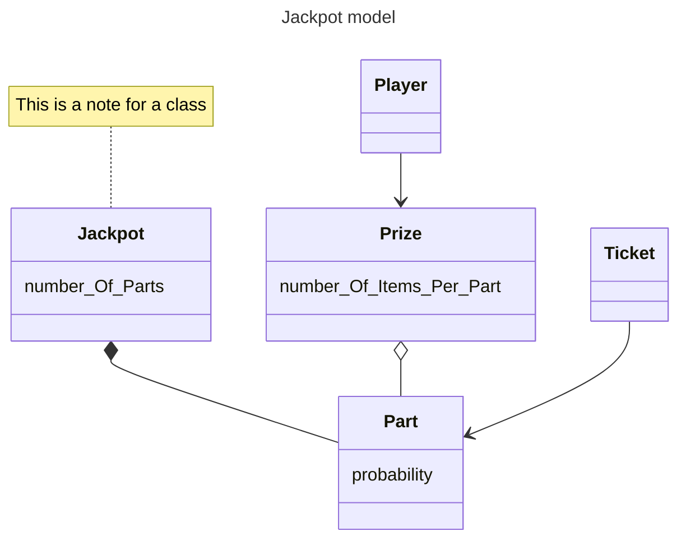

# Execute drawing

```mermaid
---
title: Jackpot model
---
classDiagram
    class Jackpot {
        number_Of_Parts
    }
    class Part {
        probability
    }
    class Prize {
        number_Of_Items_Per_Part
    }
    class Ticket
    class Player

Jackpot *-- Part
Prize o-- Part
Ticket --> Part
Player --> Prize

note for Jackpot "This is a note for a class"

```
